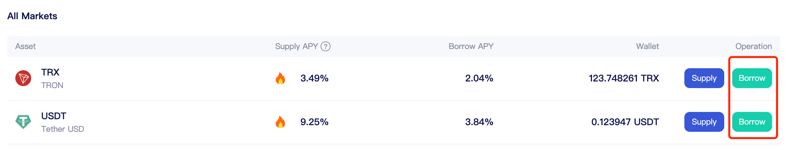

# Smart Contract API

## Smart Contract Address

.png>)

### Query interface

#### Liquidation Incentive&#x20;

function liquidationIncentiveMantissa() view returns (uint)&#x20;

**Feature description:** By calling the liquidationIncentiveMantissa function of the Unitroller contract, liquidation incentives can be inquired. Liquidators will be given a proportion of the borrower's collateral as an incentive, which is defined as liquidation incentive. This is to encourage liquidators to perform liquidation of underwater accounts.&#x20;

**Parameter description:** N/A&#x20;

Returns：&#x20;

.png>)

#### getAccountLiquidity function&#x20;

getAccountLiquidity(address account) view returns (uint, uint, uint)&#x20;

**Feature description:** By calling the getAccountLiquidity function of the Unitroller contract, account information can be accessed through an account's address to determine whether the account should be liquidated or not.&#x20;

**Parameter description**:&#x20;

.png>)

**Return value:**

