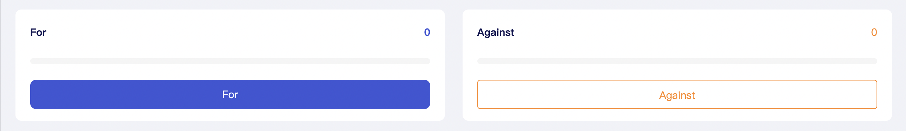
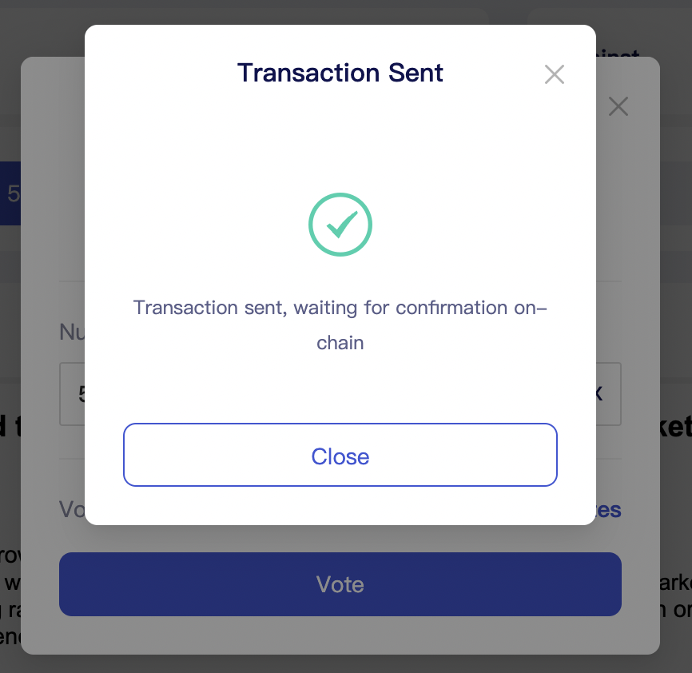
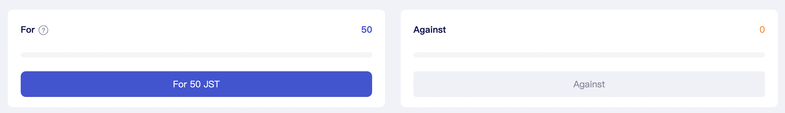

# How to Vote?

1.Select a project from the Voting for Governance list to vote for or against it.

2.Enter the number of votes in the voting box and click on “Vote”.

3.Please click on the "Accept" button in the TronLink Request Signature pop-up window to confirm your votes.

4\. After confirmation, you will be notified that the transaction has been sent. You can go to the voting page to check the details.

